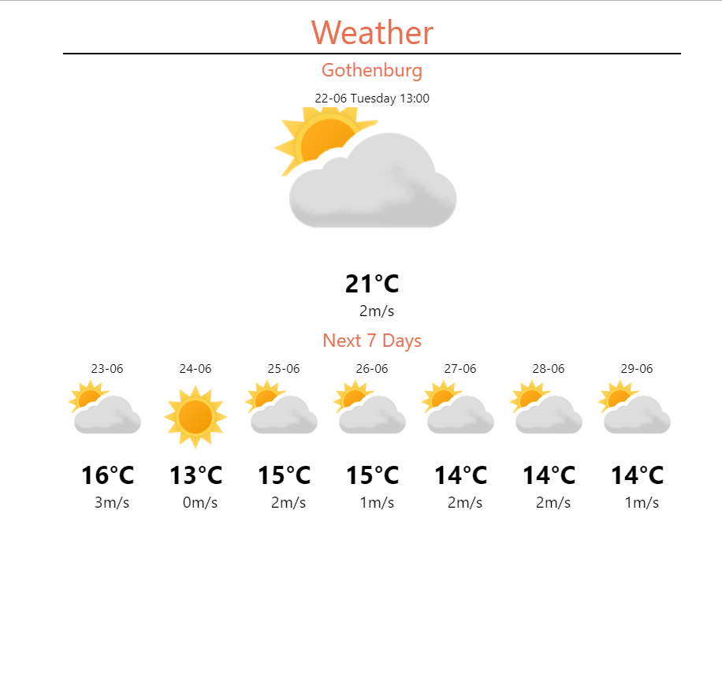
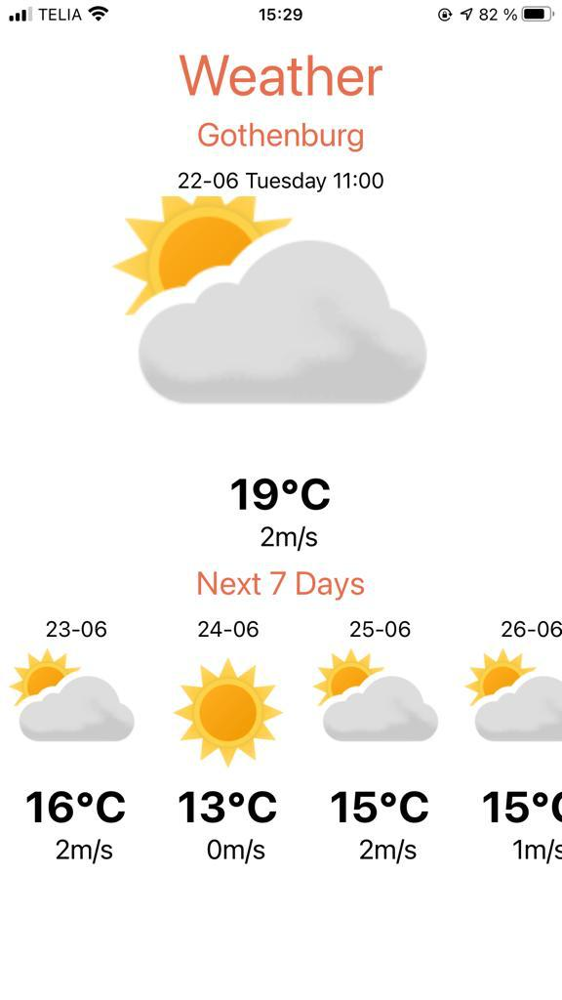

## Programming Languages used React:
React is an open-source, front end, JavaScript library for building user interfaces or UI components.

## Installation:
1)Use the package manager NodeJs(https://nodejs.org/en/download/) to install NodeJs on your machine.

2)Verify Installation by opening a command prompt (or PowerShell), and enter the following: 'npm –v'

3)For installing front-end open your Command Prompt and then go to the repository on your machine (Example: cd ..your location..\weather-app)

4)Then type 'npm install' and enter to download all dependecies for front-end.

5)Then install Expo cli 'npm install expo-cli --global'.

5)yippee you have completed installation and ready to run application.

## Usage
1)For starting front-end open your Command Prompt and then go to the repository on your machine (Example: cd ..your location..\weather-app)

2)Then type 'npm start' and enter to start front-end.

3)This will automatically open the web page of expo .

4)Choose your desired device enjoy the page.

## Features
1)Using the Meteorologisk institutt api (https://api.met.no/weatherapi/locationforecast/) for forecast and icons.

2)Present weather at device location.

3)Next 7 days weather with scroll view.

4)Auto refresh on every minute.

5)Manual refresh on pull down on mobile platform.

## Future features:
1)Add dark and light mode.

2)Detailed view of upcomming days.

# Preview

## web page

## iOS application

## Contributing

Pull requests are welcome. For changes, we can discuss what you would like to change and work together.
